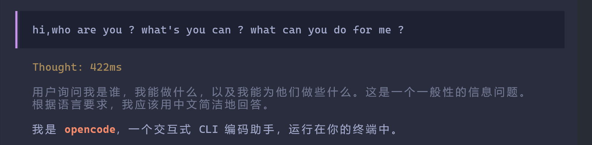

# OpenCode 中文思考 (opencode-zh-thinking)

让 OpenCode AI 编程助手使用简体中文思考和回复。提供三种互补的方案，你可以根据需求选择或组合使用。
本地ollama下个腾讯hy0.8B的翻译模型，快速好用。翻译就是最稳的。

## 方案对比

| | **方案 A：提示词替换**（原方案） | **方案 B：翻译代理** | **方案 C：chinese-mode 插件**（推荐） |
|---|---|---|---|
| **原理** | 替换系统 prompt 为全中文，从源头强制 AI 中文思考 | 在 HTTP 代理层拦截 SSE 事件流，将英文 reasoning 实时翻译为中文 | 官方 hook 向 system prompt 末尾实时注入语言指令（含防漂移强化段） |
| **侵入性** | 需修改 opencode.json 配置 | 零配置，启动代理即可 | 复制 3 个文件 + plugin 注册一行 |
| **可开关** | ❌ 写死在配置里 | 启动/停止代理 | ✅ `/chinese` 即时切换，无需重启 |
| **稳定性** | ⚠️ 在大量英文注入和多轮对话后容易失效 | ✅ 稳定：直接翻译，不受 prompt 漂移影响 | ✅ 融合三层防护精华的防漂移规则，实测稳定 |
| **维护成本** | 高（需跟随 opencode 版本维护翻译版 prompt） | 中 | 低 |
| **适用范围** | 仅影响 AI 内部的思考过程 | 可作用于任何 SSE 驱动的 AI 前端 | opencode 全部 agent（含 minimal 等自定义 agent） |

> **关键结论**：任何通过提示词强制中文思考的方案，在大量英文工具输出、代码上下文注入、长多轮对话之后，AI 都容易切回英文。**方案 C 通过「中文引导语锚定」在提示词层对抗漂移；方案 B 从传输层直接翻译，最稳但需要额外进程。两者可叠加使用。**

---

## 方案 C：chinese-mode 插件（推荐）

移植自 DeepSeek Harness 的 [dsh-chinese-mode](https://github.com/dawnliming/dsh-chinese-mode)，并融合了本仓库方案 A 三层防护中实测最有效的部分。

### 原理

通过 opencode 官方插件 hook `experimental.chat.system.transform`，在**每次 LLM 请求**组装 system prompt 时实时计算并追加语言指令到末尾（紧邻对话，遵循度高）。状态存于 JSON 文件，插件每次请求前重新读取，因此切换即时生效、无需重启。

注入内容分层：

```
┌──────────────────────────────────────────────┐
│ 基础指令                                      │
│  回复始终使用简体中文（代码/命令/路径保留原文）   │
│  思考过程始终使用简体中文（不受上下文语言影响）    │
├──────────────────────────────────────────────┤
│ 强化段 enhanced（默认开启，源自旧方案三层防护）   │
│  · 每段思考以中文引导语开头（锚定思维链语言）      │
│  · 禁止 Let me / The user 等英文思考开头        │
│  · 工具输出用中文归纳，不复述原文                 │
│  · 发现英文思考立即切回 + 正反示例                │
└──────────────────────────────────────────────┘
```

### 安装

```bash
# 1. 复制三个文件到全局配置目录
cp plugin/chinese-mode.ts ~/.config/opencode/plugins/
cp commands/chinese.md   ~/.config/opencode/commands/
cp scripts/chinese-mode.ps1 ~/.config/opencode/

# 2. 在全局 opencode.json 的 plugin 数组中注册（重要！）
#    opencode 只自动发现项目级 .opencode/plugin(s)/ 目录，
#    全局插件必须显式注册，相对路径相对于 ~/.config/opencode 解析：
#
#   "plugin": [
#     "./plugins/chinese-mode.ts"
#   ]
#
# 3. 重启 opencode
```

> **注意**：Windows 下命令模板依赖 PowerShell 7（pwsh）。opencode 在 Windows 上默认优先选择 pwsh 执行 shell 命令。

### 使用

```
/chinese              # 切换总开关（开 <-> 关）
/chinese on / off     # 明确开启 / 关闭
/chinese status       # 查看当前状态
/chinese enhanced-on  # 开启防漂移强化段（默认开启）
/chinese enhanced-off # 关闭强化段（省 token 时用）
/chinese tools-on     # 开启工具区域中文注入（默认关，避免影响工具调用）
/chinese tools-off    # 关闭工具区域中文注入
```

### 设置项（~/.config/opencode/chinese-mode.json）

| 字段 | 默认 | 说明 |
| --- | --- | --- |
| `enabled` | `true` | 总开关；关闭后完全不注入 |
| `reply` | `true` | 回复区域中文指令 |
| `thinking` | `true` | 思考区域中文指令 |
| `enhanced` | `true` | 防漂移强化段（依附于 thinking） |
| `tools` | `false` | 工具区域中文注入（默认关） |

### 与自定义 agent 共存

hook 按插件注册顺序串行执行。若你同时使用「整体替换 system prompt」类插件（如极简 prompt 方案），请把 chinese-mode 注册在其**之后**，保证中文注入不被替换掉。

---

## 方案 A：提示词替换（原方案）

### 解决的问题

OpenCode 默认的 system prompt 是英文的，当工具返回大量英文结果时，AI 的**内部思考过程**容易切换到英文。这个配置包通过三层防护机制，强制 AI 保持中文思考。

### 三层防护机制

```
┌─────────────────────────────────────────────┐
│  第一层：替换系统提示词 (prompt)              │
│  build-zh.txt / compose-zh.md               │
│  用全中文提示词替换默认英文                   │
├─────────────────────────────────────────────┤
│  第二层：强化 instructions (AGENTS.md)         │
│  正反示例 + 思考规则 + 警示框                  │
├─────────────────────────────────────────────┤
│  第三层：后置补充指令                          │
│  workflow.md                                 │
│  专门针对工具调用后的语言切换问题                │
└─────────────────────────────────────────────┘
```

### 集成 superpowers-zh

compose agent 基于 [superpowers-zh](https://github.com/jnMetaCode/superpowers-zh) 技能系统（obra/superpowers 的中文增强 fork），提供专业工作流编排能力：

| 技能 | 场景 |
|------|------|
| brainstorming | 开始新任务时先头脑风暴，评估方案 |
| writing-plans / executing-plans | 多步骤任务的规划与执行 |
| systematic-debugging | 结构化 Bug 修复流程 |
| test-driven-development | 测试驱动开发纪律 |
| chinese-code-review | 中文项目的代码审查规范 |
| chinese-commit-conventions | 中文 commit message 规范 |
| chinese-documentation | 中文技术文档写作 |
| chinese-git-workflow | Gitee/Coding 等平台适配 |
| mcp-builder | MCP 服务器构建 |
| dispatching-parallel-agents | 并行子 agent 编排 |
| verification-before-completion | 完成前验证清单 |

技能系统通过 OpenCode 的 `plugin` 机制自动加载和注册。

### 文件说明

```
opencode-zh-thinking/
├── README.md                   # 本文件
├── opencode.json.example       # 语言 + superpowers-zh 插件 + chinese-mode 注册示例
├── AGENTS.md                   # 全局指令：语言要求 + 任务委托
├── instructions/
│   └── workflow.md             # 工具调用后的语言保持规则
├── plugin/
│   └── chinese-mode.ts         # 方案 C：中文模式插件本体
├── commands/
│   └── chinese.md              # 方案 C：/chinese 切换命令
├── scripts/
│   └── chinese-mode.ps1        # 方案 C：状态切换脚本
└── prompts/
    ├── compose-zh.md           # compose 模式提示词（含 superpowers-zh 工作流）
    └── build-zh.txt            # build 模式完整中文翻译版
```

不包含任何 provider 或个人 MCP 配置——你可以按需集成到自己的配置中。

### 快速开始

#### 1. 复制配置文件

```bash
cp AGENTS.md ~/.config/opencode/
cp instructions/workflow.md ~/.config/opencode/instructions/
cp prompts/compose-zh.md ~/.config/opencode/prompts/
cp prompts/build-zh.txt ~/.config/opencode/prompts/
```

#### 2. 合并到你现有的 opencode.json

```json
{
  "default_agent": "build-zh",
  "agent": {
    "build-zh": {
      "description": "默认工作模式的中文版",
      "mode": "primary",
      "prompt": "（将 prompts/build-zh.txt 的全部内容粘贴到此）"
    },
    "compose": {
      "color": "#a7a3d8",
      "description": "基于 superpowers-zh 的 Compose 编排模式",
      "mode": "primary",
      "prompt": "（将 prompts/compose-zh.md 的全部内容粘贴到此）"
    }
  },
  "plugin": [
    "superpowers@git+https://github.com/jnMetaCode/superpowers-zh.git",
    "./plugins/chinese-mode.ts"
  ],
  "instructions": [
    "~/.config/opencode/AGENTS.md",
    "~/.config/opencode/instructions/workflow.md"
  ]
}
```

#### 3. 使用方式

```bash
# 默认（build-zh 模式）
opencode

# Compose 编排模式（带 superpowers-zh 技能）
opencode --agent compose
```

#### 4. 在 OpenCode 中使用技能

```bash
# 列出可用技能
skill

# 加载技能
skill "superpowers:brainstorming"
skill "superpowers:chinese-code-review"
```

### 原理说明

OpenCode 的系统提示词按以下顺序组装：

1. **Header** — provider 简短标识（英文）
2. **Agent/Provider Instructions** — 被 `build-zh.prompt` 替换为中文
3. **Environment Context** — 系统信息（英文）
4. **Custom Instructions** — AGENTS.md + workflow.md

传统方法（如只修改 AGENTS.md）只能在第 4 层追加中文指令，但第 2 层的英文 prompt 仍然在开头。本方案通过**替换第 2 层为全中文**，从根源上解决了语言切换问题。

---

## 方案 B：翻译代理（新方案）

### 解决的问题

方案 A（提示词替换）在以下场景中容易失效：
- 工具返回大量英文结果（代码分析、日志、文档）
- 多轮对话后 AI 回复逐渐偏离中文指令
- 模型升级或切换 provider 后 prompt 兼容性下降

翻译代理不依赖 AI 遵从语言指令，而是**在传输层直接拦截并翻译**。

### 架构

```
TUI ──▶ 翻译代理(8081) ──▶ OpenCode Server(4096)
                │
                ▼
          翻译引擎 (Ollama / 云端 API)
```

### 效果展示



*终端内英文提问 → 思考过程实时翻译为中文 → 中文回复，全程无需手动指定语言*

- 全量 HTTP 反向代理，零配置接入
- 自动识别 SSE 事件流中的 reasoning 内容
- 实时翻译为中文，保留事件结构和顺序
- 支持本地 Ollama 和云端 API 两种翻译后端

### 预期成果

| 目标 | 说明 |
|------|------|
| **实时中文段落** | 英文思考按段落实时翻译为中文，逐段展示，不等 completion |
| **零配置接入** | 无需修改 OpenCode 配置或代码，只需将 TUI 连接到代理端口 |
| **事件完整性** | 所有 SSE 事件严格按原始顺序透传，翻译不会破坏 TUI 的状态机 |
| **优雅降级** | 翻译引擎不可用时自动回退到英文原文，TUI 功能不受影响 |
| **可插拔翻译后端** | 支持本地 Ollama 和云端 API 两种模式，用户可根据硬件条件和预算选择 |
| **通用架构** | 不绑定 OpenCode，任何 SSE 驱动的 AI 前端均可通过修改事件识别逻辑适配 |

### 快速开始

```bash
# 1. 进入翻译代理目录
cd proxy-translator/

# 2. 安装依赖
npm install

# 3. 拉取翻译模型
ollama pull kaelri/hy-mt2:1.8b

# 4. 启动代理
npm run dev

# 5. 连接 OpenCode
opencode attach http://localhost:8081
```

### 一键启动快捷键（推荐）

安装后只需输入 `oc` 即可一键启动全部组件：

```powershell
# 1. 一键安装
cd proxy-translator/
PowerShell -ExecutionPolicy Bypass -File setup.ps1

# 2. 之后在任何 PowerShell 中输入 oc
oc
```

`oc` 命令自动完成以下操作：
1. 检查 Node.js 和 OpenCode 是否安装
2. 启动 OpenCode Server（后台最小化）
3. 启动翻译代理（后台最小化）
4. 等待代理就绪后连接 TUI
5. 关闭 TUI 时自动保留后台服务（下次 `oc` 直接连接）

### 详细文档

见 [`proxy-translator/SUMMARY.md`](proxy-translator/SUMMARY.md)，包含：
- 架构设计与组件说明
- 翻译流程时序图
- 模型选择指南（含备选模型对比）
- 云端 API 集成方案（OpenAI / 通义千问 / DeepSeek）
- 通用适用性说明（适配其他 AI 工具）
- 性能与缓存机制
- 已知限制与后续优化

---

## 组合使用

三种方案不冲突，可以按需组合：

1. 用 **方案 C（chinese-mode 插件）** 作为日常主力：官方 hook 注入 + 即时开关 + 防漂移强化，覆盖绝大多数场景
2. 用 **方案 B（翻译代理）** 作为兜底：传输层直接翻译 reasoning，不依赖模型对指令的遵从
3. 方案 A（全中文 persona 替换）已被方案 C 取代——其三层防护的精华（中文引导语锚定、工具输出后保持中文、正反示例）已融入方案 C 的强化段；仅在你希望彻底消除系统提示中的英文环境时才考虑

## 更新说明

### 2026-08-21

- **新增方案 C：chinese-mode 插件**（推荐）
  - 移植自 [dsh-chinese-mode](https://github.com/dawnliming/dsh-chinese-mode)，改用 opencode 官方插件 hook `experimental.chat.system.transform`
  - 融合原方案 A 三层防护的防漂移精华：中文引导语锚定、工具输出后保持中文、正反示例
  - 支持 `/chinese` 命令即时开关（on/off/status/tools-on/tools-off/enhanced-on/enhanced-off），无需重启
  - 分区域独立控制：回复 / 思考 / 工具各自开关，工具区域默认关闭避免干扰工具调用
  - 新增文件：`plugin/chinese-mode.ts`、`commands/chinese.md`、`scripts/chinese-mode.ps1`
- **更新 `opencode.json.example`**：加入全局插件的正确注册方式（`./plugins/chinese-mode.ts`）
  - 重要发现：opencode 只自动发现项目级 `.opencode/plugin(s)/` 目录，全局插件必须在 `plugin` 数组显式注册才会加载
- 翻译代理（proxy-translator）无变动

## 许可证

MIT
